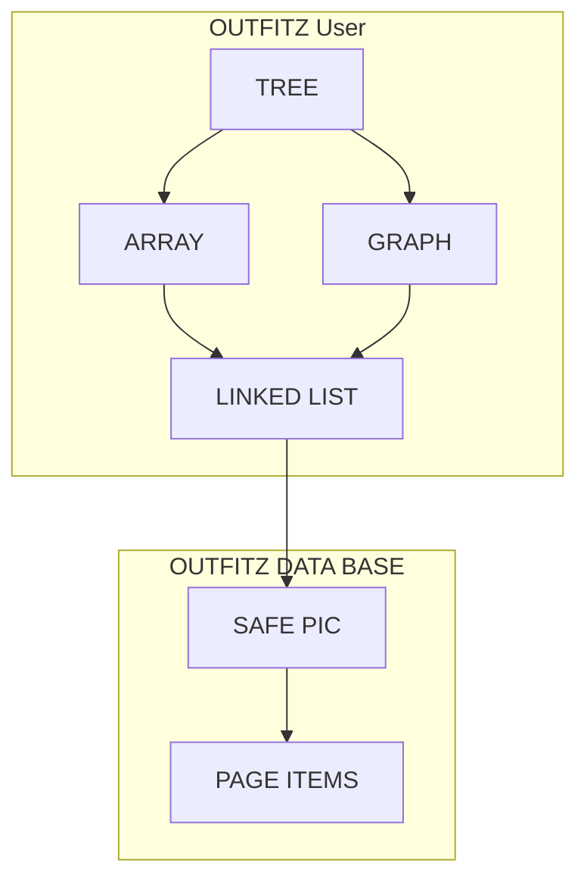
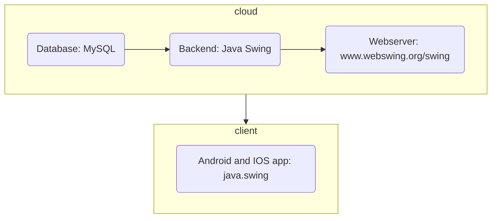

## 1.1 Latar Belakang

Outfit atau berpakaian sehari-hari sangat diperhatikan oleh sebagian orang. Apalagi seseorang sudah mulai beranjak remaja sehingga memerhatikan penampilan supaya terlihat lebih menarik terhadap lawan jenis, bahkan seseorang berpenampilan supaya terlihat keren,hedon ataupun terlihat menarik bagi semua orang. Namun dalam suatu kasus seseorang terkadang merasa menjadi tidak percaya diri atas penampilan mereka dan bingung dalam mengenakan outfit , bisa jadi karena terlalu banyak pakaian yang dimiliki maupun tiba-tiba merasa tidak cocok dengan outfit yang mereka pakai. Tidak sedikit bagi sebagian orang menghabiskan waktu yang lama dalam menentukan atau memikirkan pakaian yang ingin dia pakai, bahkan menggonta-ganti pakaian mereka sebelum keluar rumah. Sehingga mereka menghabiskan banyak waktu karena harus mengenakan pakaian satu persatu untuk melihat kesesuaian outfit yang akan mereka kenakan. Hal itu juga menguras tenaga Jadi  saya memberikan solusi untuk permasalahan ini. Saya membuat sebuah aplikasi sehingga pengguna dapat dengan mudah memutuskan outfit yang mereka akan pakai pada suatu waktu.

## 1.2. Deksripsi Teknologi Informasi

Saya yakin aplikasi yang saya kembangkan dapat menyelesaikan permasalahan bagi sebagian orang dan menjadi jawaban bagi orang yang membutuhkan. Dalam aplikasi tersebut pengguna dapat menginput outfit yang dia punya dengan file foto sehingga pengguna dapat mengkolaborasikan antara beragam jenis baju dengan beberapa jenis celana,termasuk outfit tambahan seperti sepatu,topi,kacamata, dll. Pengguna juga dapat menemukan berbagai macam ide outfit terkini yang akan terus saya update.Saya juga mengembakan fitur wishlist di dalam aplikasi tersebut sehingga mereka dapat memasukkan pakaian yang ingin merekan miliki ataupun mereka beli. Kemudian saya juga mengembangkan sebuah fitur yang mana pengguna juga dapat membuat jadwal outfit.Fitur ini tentu sangat berguna bagi kalangan mahasiswa-mahasiswi yang masi dalam masa perkuliahan.
Karena saya mengembangkan aplikasi ini, seseorang tidak lagi harus menghabiskan waktu berlama-lama di depan cermin untuk mencoba outfit yang cocok dikenakan satu persatu. Mereka juga dapat melihat jadwal outfit yang telah mereka buat.
Oleh karena itu saya menamai aplikasi ini dengan OutfitZ. Outfit berarti apliksi outfit dan huruf Z berarti nama developer yaitu nama belakang saya yaitu Zurrahman.

## 1.3. Branding

Pada tahap ini kita mengeksplorasi branding dari sistem yang dibuat. Branding meliputi:
•	Merk: Outfit
•	Tagline: Outfit bebas asal sopan
•	Campaign: Bagaimana membuat aplikasi yang memberikan ide kepada penggunanya dalam beroutfit dan  menemukan jenis pakaian yang cocok untuk serta mengkolaborasikan beragam jenis outfit yang ingin dia gunakan.
•	Target user:
o	Usia 16+ tahun keatas
o	Seorang yang sangat mementingkanoutfit dan gaya berpakaiannya.
o	Seorang yang suka bingung dalam menetukan outfit sehari-hari.
o	Seorang yang ingin mengetahui jenis outfit atau pakaian yang cocok untuk dirinya.
o	Seorang yang paham akan adab dan ketentuan dalam berpakaian sopan.
o	Seorang yang suka mengkolaborasikan oufit yang ingin dia gunakan.

•	User experience theme:
o	Mudah
o	Sederhana
o	Menyenangkan
o	Menarik
o	Warna: ala suasana abu-abu, kuning, smooth
o	Inspirasi desain: 

## 2. User Story

Sebagai | Saya ingin bisa | Sehingga  | Prioritas
---|---|---|---
Pengguna|menemukan ide outfit|saya menemukan mendapatkan inspitrasi dalam beroutfit| ⭐⭐⭐⭐⭐
Pengguna|menge-test jenis outfit|saya menemukan outfit yang cocok untuk diri saya | ⭐⭐⭐⭐
Pengguna|mengatur kesesuaian pakaian|saya mengetahui dan meneukan kombinasi pakaian yang cocok| ⭐⭐⭐
Pengguna|mengkolaborasikan outfit|saya bisa menggunakan kolaborasi yang menurut saya bagus dan keren | ⭐⭐⭐⭐
Pengguna|mengatur jadwal outfit|saya bisa dengan mudah dan teratur dalam beroutfit tanpa kebingunan | ⭐⭐⭐
Pengguna|membuat wishlist outfit|saya bisa tahu outfit apa yang akan saya beli kedepannya | ⭐⭐⭐
Pengguna|membeli outfit di toko dalam apk OutfitZ|saya langsung dengan mudah membeli pakaian yang saya inginkan | ⭐⭐⭐
Pengguna|melakukan pembayaran dengan M-Banking/E-wallet|saya dengan mudah melakukan pembayaran online langsung dari saldoyang dimiliki | ⭐⭐
Pengguna|membuat karakter AI 3D |saya dapat membuat karakter AI yang mirip dengan saya| ⭐⭐⭐
Pengguna|mekarakteristikkan karakter AI 3D |saya mencocokkan pakaian kepada karakter AI| ⭐⭐⭐
Pengguna|bercermin dengan kamera depan|saya tidak perlu lagi ke apk kamera| ⭐
Pengguna|menentukan jenis outfit seperti apa |saya dapat menemukan ide-ide outfit sesuai selera saya| ⭐⭐⭐
Pengguna|memasang pengingat jadwal outfit|saya tidak lupa tentang hari penting dengan outfit tertentu| ⭐⭐
Pengguna|melakukan browsing tentang suatu event |saya mendapatkan ide outfit yang akan dipakai dalam acara itu| ⭐⭐⭐
Pengguna|melihat bagaimana pakaian dilihati dari jauh-dekat |saya mengetahui tingkat kestabilan pakaian dan warna dari berbagai jarak| ⭐⭐

## 3. Struktur Data

## 4. Arsitektur Sistem

## 5. Teknologi, Library, dan Framework

saya menggunakan dalam mengembakan game ini dengan

- Smartphone redmi 9
- Laptop Lenovo dengan RAM 8GB ,dengan system operasi Windows 11
- Laptop HP 15s du3577tu intel i3 gen11 dengan RAM 8GB DDR4-3200MHz (2x4GB), SSD PCIe® NVMe™ M.2 512 GB, dengan system operasi Windows 11 Home
- Chrome
- Youtube
  
Framework
- Eclipse IDE dengan bahasa Java Swing

Library
-
-

## 6. Desain User Experience dan User Interface

(https://www.figma.com/file/e4rLFalwdJKWkR84mdjzJJ/Onboarding-Screens-for-iOS-(Community)?type=design&node-id=0%3A1&mode=design&t=wGFcPAsWx8fdRBPP-1)
## 7. Demonstrasi Video

Link youtube nya

## 8. Bagaimana mesin komputasi dan sistem operasi berperan dalam produk teknologi informasimu ?

Link youtube nya di detik jawaban ini

## 9. Bagaimana algoritma, struktur data, dan bahasa pemrograman berperan dalam produk teknologi informasimu ?

Link youtube nya di detik jawaban ini

## 10. Bagaimana metode pengembangan perangkat lunak / Software Development Life Cycle berperan dalam produk teknologi informasimu ?

Link youtube nya di detik jawaban ini

## 11. Bagaimana database / sistem basis data berperan dalam produk teknologi informasimu ?

Link youtube nya di detik jawaban ini
